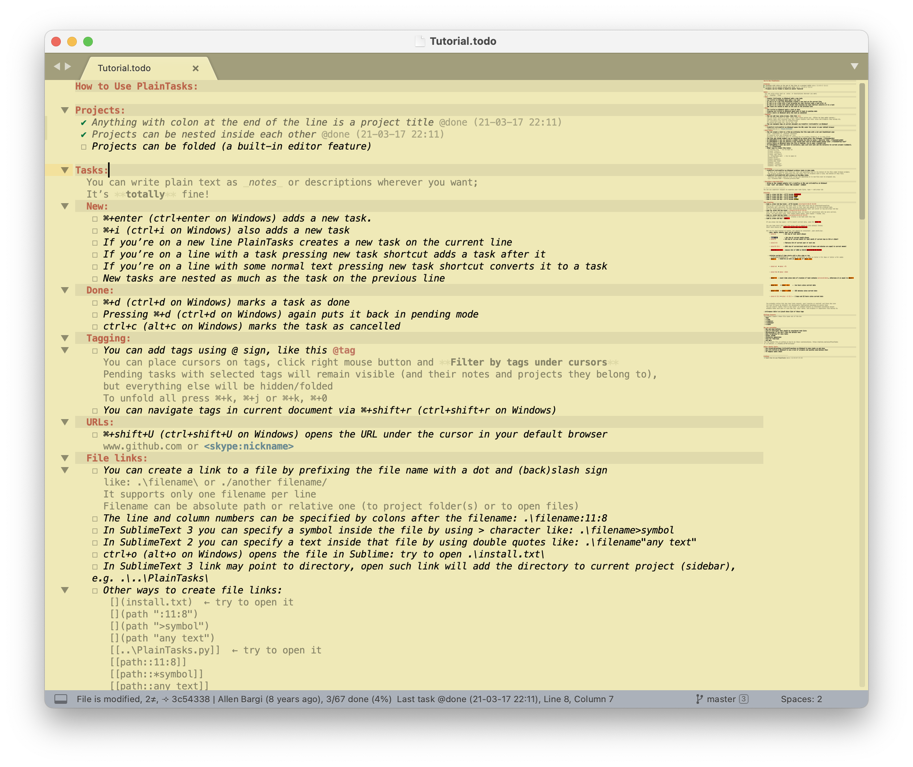

## [PlainTasks](https://github.com/aziz/PlainTasks) 

An opinionated todo-list plugin for Sublime Text (2 & 3) editor


Forked from [https://github.com/aziz/PlainTasks](https://github.com/aziz/PlainTasks), with the following modifications 

* Option to split archived tasks by date. This makes it easier to scan the archive list. Enable by setting `split_archived_by_date` to true
* Open tickets in JIRA. Press <kbd>⌘ + control + u</kbd> whilst your cursor is over a JIRA ticket number to open that ticket in your web browser. Set  `jira_domain` to, for example, `jira.example.com`. 

## Installation

To install this fork - 

1. Uninstall an existing PlainTasks installation
2. Run the following (on other platforms , change the Sublime user path as appropiate) - 
```sh 
cd ~/Library/Application Support/Sublime Text 3/Packages && git clone https://github.com/BenBanerjeeRichards/PlainTasks
```


## Start a new todo-list

In command palette (<kbd>⌘ + shift + p</kbd>), select `Tasks: New document`

Save your todo files with `todo`, `todolist`, `tasks` or `taskpaper` file extensions, or just name them `TODO` or `todolist.txt`.

## Usage
**NOTE:** In Windows or Linux use <kbd>ctrl</kbd> instead of <kbd>⌘</kbd>

* <kbd>⌘ + enter</kbd> or <kbd>⌘ + i</kbd>: new task

* <kbd>⌘ + d</kbd>: toggle task as completed.

* <kbd>ctrl + c</kbd>: toggle task as cancelled on Mac. <kbd>alt + c</kbd> on Windows/Linux.

* <kbd>⌘ + shift + a</kbd> will archive the done tasks, by removing them from your list and appending them to the bottom of the file under Archive project

* <kbd>⌘ + shift + u</kbd> will open the url under the cursor in your default browser, other than http(s) schemes must be enclosed within `<>`, e.g. `<skype:nickname>`

* Anything with colon at the end of the line is a project title, you can also nest projects by indenting them. 

* You can write plain text as notes or descriptions wherever you want. Use `_` or `*` for italic and bold just like in Markdown.

* You can add tags using **`@`** sign. To filter by tag, right click on a tag and then _Filter by tags under cursors_

* You can navigate tags in current document via <kbd>⌘+shift+r</kbd>.

* Type `---` and then <kbd>tab</kbd> to insert a separator.

* Completion rules (<kbd>ctrl+space</kbd> or <kbd>alt+/</kbd> to see list of them):  

- type `t`, press <kbd>tab</kbd> — it’ll become `@today` — this one is highlighted differently than other tags. Other tasks (also completed from their first letters) are `@critical`, `@high`, `@low` and `@started`

- After inserting`@started`, press <kbd>tab</kbd> again and current date will be inserted, when you’ll complete or cancel a task with such tag, you’ll know how many time has passed since start; if you have to change done/cancelled/started time, then you can recalculate the time spent on task by pressing <kbd>tab</kbd> while cursor is placed on a tag;
- `tg`, <kbd>tab</kbd>, <kbd>tab</kbd> work in the same manner as `s`, but inserts `@toggle(current date)` — so you can pause and resume to get more correct result when done/cancel; each toggle tag is either pause or resume depending on its place in sequence;
- `cr`, <kbd>tab</kbd>, <kbd>tab</kbd> — `@created(current date)` (<kbd>⌘ + shift + enter</kbd> creates a new task with this tag);
- `d`, <kbd>tab</kbd> — `@due( )`  
  If you press <kbd>tab</kbd> again, it’ll insert current date, same for `@due( 0)`.  
  You can type short date (similar to [OrgMode’s date prompt](http://orgmode.org/manual/The-date_002ftime-prompt.html), but not the same) and then press <kbd>tab</kbd> to expand it into default format.  
  Short date should be __`@due(year-month-day hour:minute)`__  
  Dot can be used instead of hyphen, but should be consistent _`year.month.day`_

    - year, month, minute, hour can be omitted:

        <table>
         <tr>
          <th>  Notation    </th><th>   Meaning     </th>
         </tr>
         <tr>
          <td>  <code>@due(1)</code>    </td>
          <td>  1st day of next month always    </td>
         </tr>
         <tr>
          <td>  <code>@due(--1)</code>    </td>
          <td>  1st day of current month always    </td>
         </tr>
         <tr>
          <td>  <code>@due(5)</code>    </td>
          <td>  5th day of current month (or next month if current day is 5th or older) </td>
         </tr>
         <tr>
          <td>  <code>@due(2-3)</code>  </td>
          <td>  February 3rd of current year or next one    </td>
         </tr>
         <tr>
          <td>  <code>@due(31 23:)</code>   </td>
          <td>  31st day of current/next month at 23 hours and minutes are equal to current moment  </td>
         </tr>
         <tr>
          <td>  <code>@due(16.1.1 1:1)</code>   </td>
          <td>  January 1st of 2016 at 01:01    <code>@due(16-01-01 01:01)</code>  </td>
         </tr>
        </table>

    - relative period of time starts with a plus sign or two  
      __`+[+][number][DdWw][h:m]`__ — number is optional as well as letter `d` for days or letter `w` for weeks.

        <table>
         <tr>
          <th>  Notation    </th><th>   Meaning     </th>
         </tr>
         <tr>
          <td>  <code>@due(+)</code>    </td>
          <td>  tomorrow as well as <code>@due( +1)</code> or <code>@due( +1d)</code></td>
         </tr>
         <tr>
          <td>  <code>@due(+w)</code>    </td>
          <td>  one week since current date, i.e. <code>@due( +7)</code></td>
         </tr>
         <tr>
          <td>  <code>@due(+3w)</code>  </td>
          <td>  3 weeks since current date, i.e. <code>@due( +21d)</code></td>
         </tr>
         <tr>
          <td>  <code>@due(++)</code>   </td>
          <td>  one day since <code>@created(date)</code> if any, otherwise it is equal to <code>@due(+)</code></td>
         </tr>
         <tr>
          <td>  <code>@due(+2:)</code>   </td>
          <td>  two hours since current date</td>
         </tr>
         <tr>
          <td>  <code>@due(+:555)</code>   </td>
          <td>  555 minutes since current date</td>
         </tr>
         <tr>
          <td>  <code>@due(+2 12:)</code>   </td>
          <td>  2 days and 12 hours since current date</td>
         </tr>
        </table>

* You can create a link to a file within your project by prefixing the file name with a dot and (back)slash like: `.\filename\` or `./another filename/`.  
* Org Mode and Markdown styles also supported - see the [Reference.md](Reference.md)


### Editor Useful Tools:

* Use **<kbd>⌘ + control + up/down</kbd>** (**<kbd>ctrl + shift + up/down</kbd>** on Windows) to move tasks up and down.

* Use **<kbd>⌘ + r</kbd>** to see a list of projects and quickly jump between them


★ See the [Tutorial](https://github.com/aziz/PlainTasks/blob/master/messages/Tutorial.todo) for more detailed information.

For more in-depth documentation, see [Reference.md](Reference.md)

### Customisation
View [Customisation.md](Customisation.md) for more information 


## PlainTasks for other editors
NOTE: These are separate projects, maintained by some awesome developers other than us.
- [Atom: Tasks plugin](https://atom.io/packages/tasks)
- [Vim: Plaintasks.vim](https://github.com/elentok/plaintasks.vim)
- [Visual Studio Code: To Do Tasks](https://github.com/sandy081/vscode-todotasks)
- [Visual Studio Code: Todo+](https://marketplace.visualstudio.com/items?itemName=fabiospampinato.vscode-todo-plus)


## Contributors
- @antonioriva
- @binaryannie
- [Ben Johnson](https://github.com/benjohnson)
- [Craig Campbell](https://github.com/ccampbell)
- [Dominique Wahli](https://github.com/bizoo)
- [Germán M. Bravo](https://github.com/Kronuz)
- [Hindol Adhya](https://github.com/Hindol)
- [Jesse Robertson](https://github.com/speilberg0)
- [Marc Schlaich](https://github.com/schlamar)
- [Michael McFarland](https://github.com/mikedmcfarland)
- [Pablo Barrios](https://github.com/sauron)
- [Stanislav Parfeniuk](https://github.com/travmik)
- [Vova Kolobok](https://github.com/vovkkk)

You can contribute on [github](https://github.com/aziz/PlainTasks)


## Inspiration
- Thanks to Chagel for the [iTodo plugin](https://github.com/chagel/itodo).  
- Thanks to [Taskmate for TextMate](https://github.com/svenfuchs/taskmate).
- Thanks to [TaskPaper Mac application from hogbaysoftware.com](http://www.hogbaysoftware.com/products/taskpaper)

## License
Copyright 2012-2013 [Allen Bargi](https://twitter.com/aziz). Licensed under the MIT License
